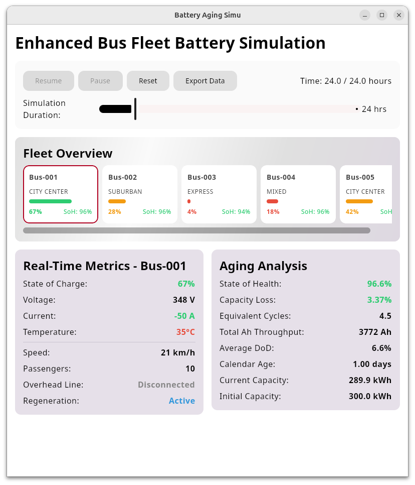
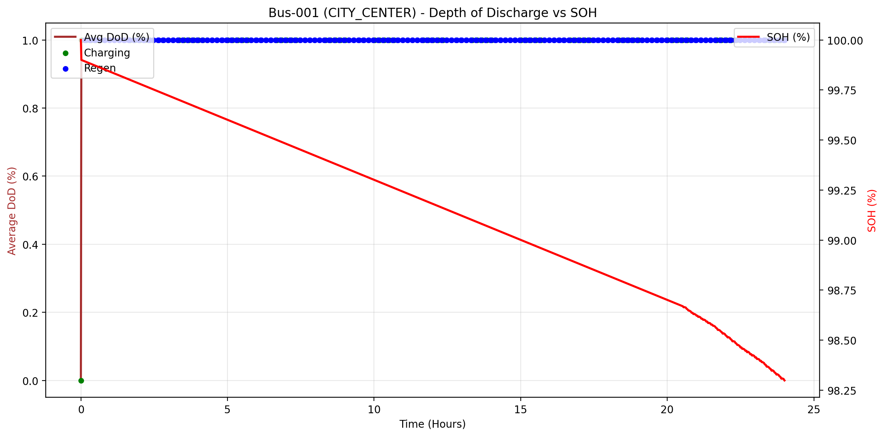
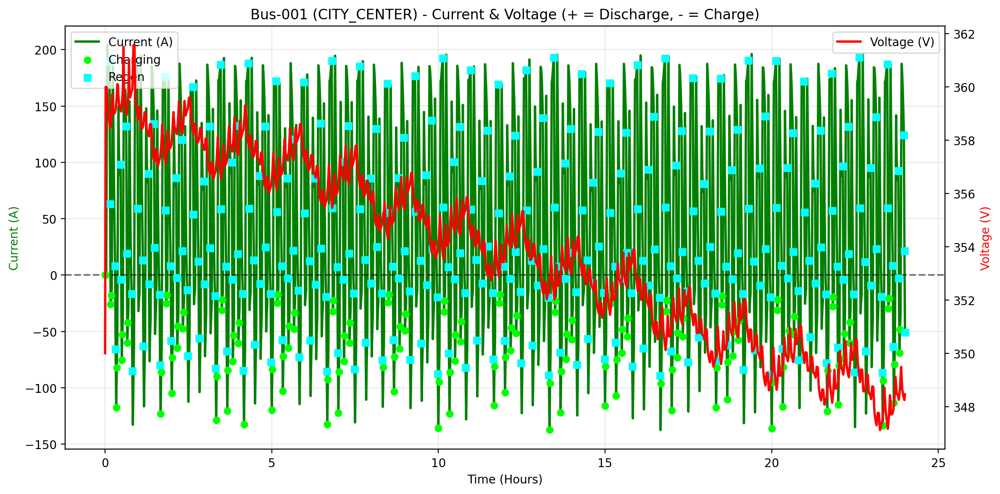

# Latest test

- **Mock fleet**
```kotlin
listOf(
    Bus("Bus-001", RouteType.CITY_CENTER, overheadCoverage = 0.5f),
    Bus("Bus-002", RouteType.SUBURBAN, routeLength = 75f, overheadCoverage = 0.3f),
    Bus("Bus-003", RouteType.EXPRESS, routeLength = 100f, avgSpeed = 50f, overheadCoverage = 0.2f),
    Bus("Bus-004", RouteType.MIXED, stopsPerRoute = 30),
    Bus("Bus-005", RouteType.CITY_CENTER, initialSoC = 0.7f, passengersAvg = 60)
)
```


## My analysis

### DoD vs SoH


**Spikes** 
- artificially bumping DoD to 8% -> then real small cycles average it back down. This triggers every 6 hours.
  - Without it: bus discharges 2-3% between charging stops

### Current vs Voltage


Discharge-charge-discharge cycles happen frequently

**Current**
- Positive values (0 to +200A) -> Discharging(powering the bus)
- Negative values (0 to -145A) -> Charging(from overhead lines->green dots)

**Voltage**
- Starts high at 360V due to being fresh
- Drops during discharge
- Recovers during charge
- Overall decline trend due to aging

### Cycling data


- **Cycle Count** (Purple): 0 -> 4.5 equivalent full cycles
- **Ah Throughput** (Orange): 0 -> 3,772 Ah total energy processed

Bus maintains steady duty cycle during 24H.

- **Energy throughput**: 3,772 Ah / 24h = 157 Ah/hour average
- **Cycle rate**: 4.5 cycles / 24h = 0.19 cycles/hour (frequent charging)

- **Yearly cycles**: 4.5/day * 365 days = ~1643 cycles/year


TODO("")