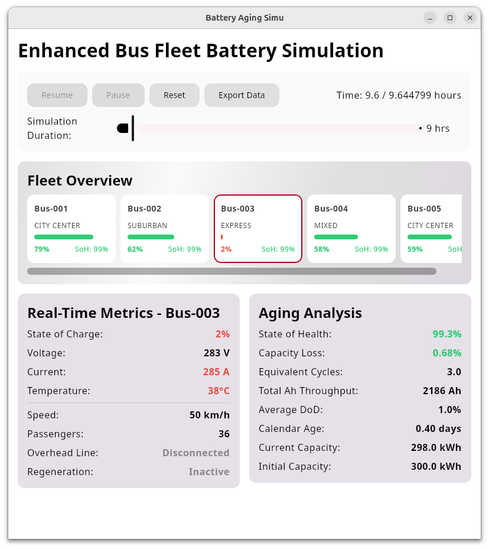
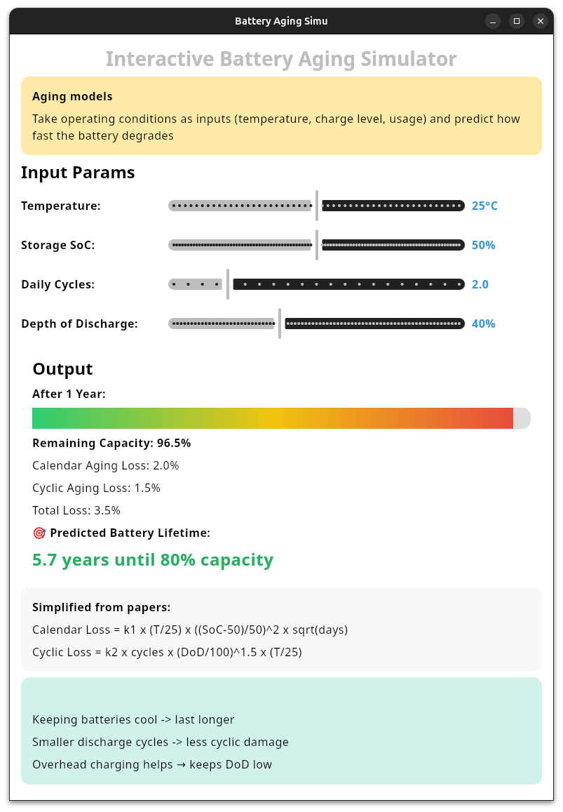

# Latest test

- **Mock fleet**
```kotlin
listOf(
    Bus("Bus-001", RouteType.CITY_CENTER, overheadCoverage = 0.5f),
    Bus("Bus-002", RouteType.SUBURBAN, routeLength = 75f, overheadCoverage = 0.3f),
    Bus("Bus-003", RouteType.EXPRESS, routeLength = 100f, avgSpeed = 50f, overheadCoverage = 0.2f),
    Bus("Bus-004", RouteType.MIXED, stopsPerRoute = 30),
    Bus("Bus-005", RouteType.CITY_CENTER, initialSoC = 0.7f, passengersAvg = 60)
)
```



# Oversimplified battery aging

